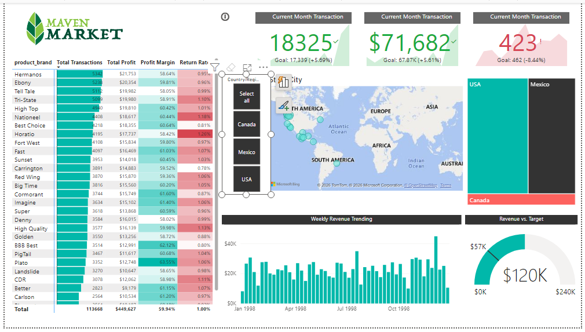

# 🏪 Maven Market Sales Performance Dashboard
### Power BI | DAX | Data Visualization
## 1. 📌 Project Objective
Analyze Maven Market's multi-country retail performance across 25+ product brands — tracking transactions, profit, return rates, and revenue vs targets to help management identify top performers and business gaps.

---

## 2. 🗂️ Dataset Overview

| Table | Description |
|---|---|
| `Transactions_Data` | Sales records — revenue, profit, transactions per brand |
| `Return_Data` | Product return records per brand |
| `Products` | Product brand names and categories |
| `Stores` | Store locations — USA, Canada, Mexico |
| `Calendar` | Date table for weekly/monthly time analysis |

---

## 3. ⚙️ Process

- Imported and cleaned 5 related tables in Power BI
- Built a star-schema data model with table relationships
- Created DAX measures for KPIs, profit margin, return rate, and revenue targets
- Designed an interactive dashboard with slicers, map, charts, and KPI cards

---

## 4. ❓ Business Questions & KPIs Solved

| Business Question | Answer / Finding |
|---|---|
| How many transactions this month? | **18,325** — 5.69% above goal (17,339) |
| What is current month revenue? | **$71,682** — 5.61% above goal ($67.87K) |
| Are product returns under control? | **423 returns** — 8.44% below goal (462) ✅ |
| Which brand has highest total profit? | **Hermanos** — $21,753 profit, 58.64% margin |
| What is overall profit margin? | **59.94%** across 113,668 total transactions |
| Are we hitting revenue target? | **$120K actual vs $240K target** — 50% achieved |
| Which country drives most sales? | **USA** leads, followed by Mexico and Canada |
| How is weekly revenue trending? | Steady growth from Jan 1998, peaking Oct 1998 |

---

## 5. 📊 Dashboard Visuals

| Visual | Purpose |
|---|---|
| **KPI Cards (x3)** | Current Month Transactions, Revenue & Returns vs Goal |
| **Brand Matrix Table** | Transactions, Profit, Margin %, Return Rate per brand |
| **World Map** | Store performance by USA / Canada / Mexico |
| **Weekly Bar Chart** | Revenue trend Jan–Oct 1998 |
| **Gauge Chart** | Actual revenue ($120K) vs target ($240K) |
| **Country Slicer** | Filter dashboard by Canada, Mexico, USA |

---

## 6. 💡 Key Insights

- **Top 3 brands by profit:** Hermanos ($21,753), Ebony ($20,354), Tell Tale ($19,982)
- **Highest return rate brands:** Horatio (1.26%), Nationeel (1.18%) — need attention
- **Transactions & Revenue are both beating monthly goals** by 5%+
- **Returns are below target** — a positive sign of product quality
- **Revenue at 50% of annual target** with Q4 1998 still pending

---

## 7. ✅ Final Conclusion

Maven Market is **performing above monthly targets** in transactions and revenue with return rates well controlled. Brand-level analysis reveals Hermanos and Ebony as star performers, while Horatio and Nationeel show elevated return rates that need investigation. The dashboard enables management to monitor health across all brands and 3 countries in real time.

---

## 🛠️ Tools Used

---

*Dashboard built by [Wasim Raja](https://github.com/wasim-wr)*
